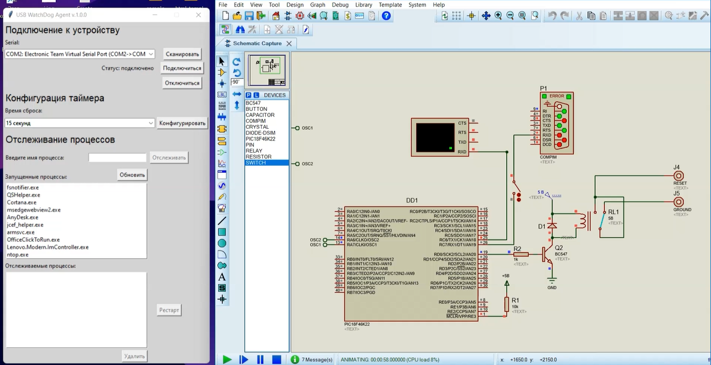

# USB WatchDog Timer Model

This is simple desktop agent for USB watchdog timer implementation.
This is study project and suites only for study cases :)



## Firmware Code

The microcontroller's firmware code is written in C and handles heartbeats and configuration from the watchdog timer agent. The `UART_handler()` function handles the heartbeats and configuration from the watchdog timer agent. The `reset()` function activates the relay and restarts the system.

## GUI App-Agent

The GUI app-agent is developed in Python and observes the programs started on the computer and resets it if something goes wrong. The app has two main frames: `ComChoosingFrame` for choosing the COM port and `TargetedAppsFrame` for specifying the targeted apps. 

The `check_targets()` function checks the targeted apps and restarts them if they are not running. The `heartbeating()` function sends a heartbeat to the watchdog timer system to indicate that everything is working correctly.

```
Copyright 2022 Alexandrov Alexey
```